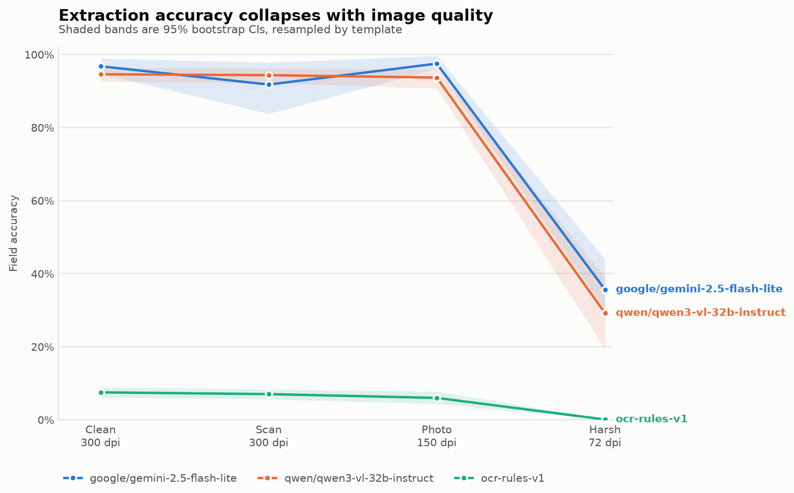
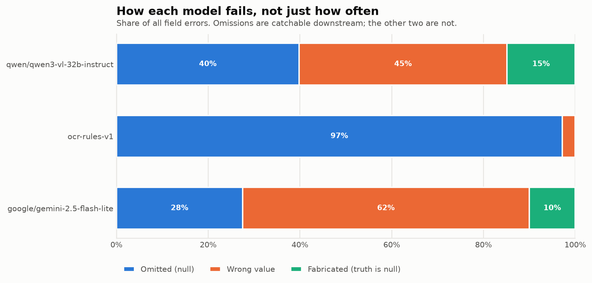
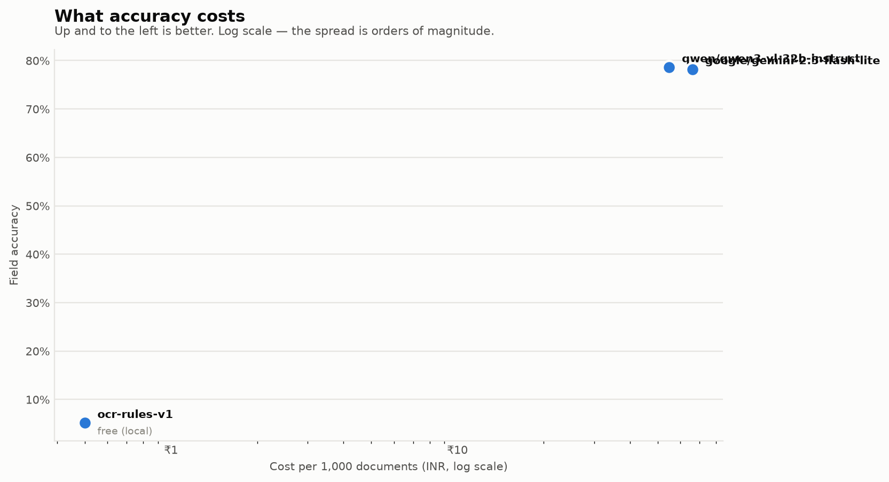

### Overall (all severity levels)

| Model | n | Calls failed | All fields (95% CI) | Header fields | Line-item fields | Doc exact match | Critical-field exact | Halluc. share of errors | Struct. err | Schema viol. |
|---|---:|---:|---|---|---|---|---|---:|---:|---:|
| qwen/qwen3-vl-32b-instruct | 247 | 137 | 78.6% [74.8, 82.4] | 73.4% [70.1, 76.2] | 80.5% [76.2, 85.2] | 16.2% [8.3, 24.7] | 43.3% [29.2, 55.7] | 60.2% | 1 | 0 |
| google/gemini-2.5-flash-lite | 24 | 24 | 78.2% [66.0, 88.4] | 77.4% [67.3, 83.4] | 78.5% [64.3, 92.2] | 25.0% [0.0, 50.0] | 37.5% [9.5, 65.2] | 72.5% | 0 | 0 |
| ocr-rules-v1 | 384 | 0 | 5.1% [4.1, 6.2] | 20.3% [16.3, 24.8] | 0.0% [0.0, 0.0] | 0.0% [0.0, 0.0] | 0.0% [0.0, 0.0] | 2.8% | 0 | 0 |

### Clean documents only

| Model | n | All fields (95% CI) | Header fields | Line-item fields | Doc exact match | Critical-field exact | Halluc. share of errors | Struct. err | Schema viol. |
|---|---:|---|---|---|---|---|---:|---:|---:|
| google/gemini-2.5-flash-lite | 7 | 96.8% [94.7, 98.9] | 94.7% [90.5, 99.0] | 97.4% [95.7, 99.6] | 28.6% [0.0, 66.7] | 71.4% [33.3, 100.0] | 33.3% | 0 | 0 |
| qwen/qwen3-vl-32b-instruct | 63 | 94.6% [92.6, 96.4] | 92.4% [89.6, 95.2] | 95.3% [93.0, 97.4] | 22.2% [11.1, 34.4] | 58.7% [37.1, 79.0] | 24.9% | 0 | 0 |
| ocr-rules-v1 | 96 | 7.5% [6.1, 8.9] | 29.6% [23.7, 35.7] | 0.0% [0.0, 0.0] | 0.0% [0.0, 0.0] | 0.0% [0.0, 0.0] | 3.5% | 0 | 0 |

_Calls that never reached the model (transport, auth or billing failures) are excluded from every accuracy number above and counted in the `Calls failed` column. They are not scored as omissions: an unpaid invoice is not a model error. Rows with a large failed count rest on a smaller corpus than the others and are not comparable at face value._

### Accuracy by degradation severity

| Model | L0_clean | L1_scan | L2_photo | L3_harsh | Drop L0→L3 |
|---|---|---|---|---|---|
| google/gemini-2.5-flash-lite | 96.8% [94.7, 98.9] | 91.8% [83.8, 97.8] | 97.5% [96.1, 99.6] | 35.6% [30.2, 44.0] | 61.1 pts |
| qwen/qwen3-vl-32b-instruct | 94.6% [92.6, 96.4] | 94.3% [92.2, 96.2] | 93.7% [90.7, 96.0] | 29.2% [19.4, 39.0] | 65.4 pts |
| ocr-rules-v1 | 7.5% [6.1, 8.9] | 7.0% [5.6, 8.4] | 6.0% [4.4, 7.7] | 0.1% [0.0, 0.2] | 7.4 pts |

### Cost and latency

| Model | Mean in-tok | Mean out-tok | Latency p50 | Latency p95 | USD / 1k docs | INR / 1k docs |
|---|---:|---:|---:|---:|---:|---:|
| ocr-rules-v1 | 0 | 0 | 0.49s | 1.07s | $0.00 | ₹0 |
| qwen/qwen3-vl-32b-instruct | 3024 | 835 | 17.62s | 91.37s | $0.66 | ₹55 |
| google/gemini-2.5-flash-lite | 4034 | 984 | 4.84s | 10.57s | $0.80 | ₹66 |

### Error mix

| Model | wrong | missing | spurious | format | hallucination share |
|---|---:|---:|---:|---:|---:|
| qwen/qwen3-vl-32b-instruct | 1648 | 1451 | 543 | 4 | 60.2% |
| ocr-rules-v1 | 644 | 22032 | 0 | 0 | 2.8% |
| google/gemini-2.5-flash-lite | 218 | 96 | 35 | 0 | 72.5% |

### Paired comparisons (McNemar, document-level exact match)

- **google/gemini-2.5-flash-lite vs ocr-rules-v1** (n=24): A better (p=0.0312, discordant 6/0); Δ exact match 25.0% [0.0, 51.7]
- **google/gemini-2.5-flash-lite vs qwen/qwen3-vl-32b-instruct** (n=24): statistically indistinguishable (p=1.000, discordant 1/1); Δ exact match 0.0% [-13.6, 10.7]
- **ocr-rules-v1 vs qwen/qwen3-vl-32b-instruct** (n=247): B better (p=0.0000, discordant 0/40); Δ exact match -16.2% [-24.5, -8.3]

### Error taxonomy

| Category | google/gemini-2.5-flash-lite | ocr-rules-v1 | qwen/qwen3-vl-32b-instruct |
|---|---:|---:|---:|
| line item split | 0 | 0 | 1 |
| field confusion | 5 | 87 | 20 |
| character misread | 62 | 168 | 643 |
| format error | 0 | 0 | 4 |
| omission | 96 | 22032 | 1451 |
| fabricated on null | 35 | 0 | 536 |
| wrong value | 151 | 389 | 988 |
| **total findings** | **349** | **22676** | **3643** |

_26668 findings auto-classified; 97 ambiguous ones sampled (stratified by model x severity x field group) into `results/review_queue.csv` for manual review._

_Smallest gap this corpus can resolve at 80% power: about 8.8 points._

### Figures

